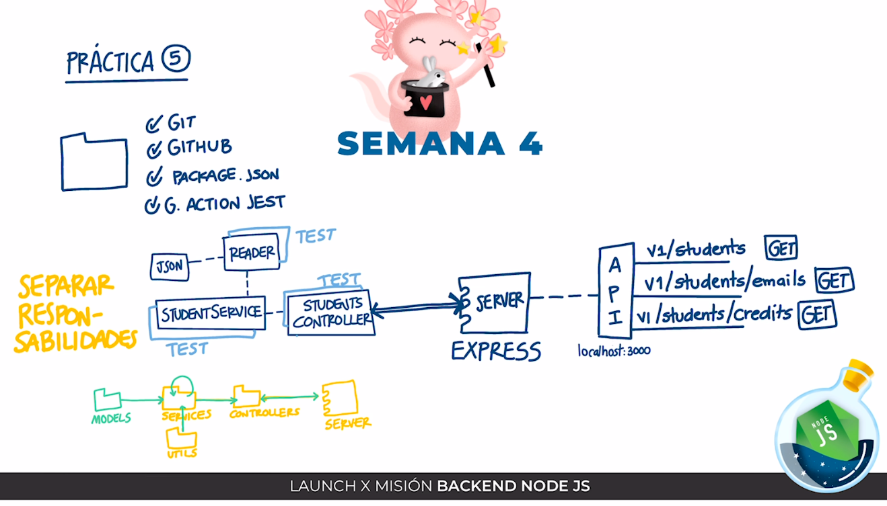

# API para los alumnos de visual partner-ship

## Dependencias
<ul>
    <li><a href="https://jestjs.io/docs/getting-started">Jest</a></li>
    <li><a href="https://eslint.org/docs/latest/">Linter</a></li>
    <li><a href="https://expressjs.com/en/guide/routing.html">Express</a></li>
</ul>
<h2>Jest</h2>
<p>La dependencia de Jest se emplea en el proyecto para llevar a cabo las pruebas unitarias.</p>
<p> Se optó por usar esta dependencia debido al choque que hay con las pruebas unitarias automatizadas por GitHub y windows.</p><br>
<h2>Linter</h2> 
    <p>Linter se ocupa para dar un formato y estilo más uniforme al proyecto.</p>
    <p>El archivo de configuración de linter lo puedes consultar <a href="https://github.com/JoseLuisMonroy/Cursos-de-Visual-Thinking-API/blob/main/.eslintrc.js">aquí</a>.</p>
<h2>Express</h2>
    <p>Express juega el papel de un servidor web para probar el API y con ello lograr crear los endpoints.</p>

## Diseño del API


## Descarga del proyecto 
Para tener el proyecto en tu ordenador realiza los siguientes pasos:
    Realiza un fork de este rpositorio
En la terminal ejecuta el siguiente comando (sustituyendo username por tu usuario en gitHub)<br>
```
git clone https://github.com/[username]/Cursos-de-Visual-Thinking-API
```
En la terminal ejecuta el siguiente comando<br>
```
cd Cursos-de-Visual-Thinking-API
```
Instala las dependencias con los siguientes comandos<br>
```
npm init -y
```
```
npm install jest --save
```
```
npm install eslint --save-dev
```
```
npm install express --save
```
```
npm init @eslint/config
```

<h2>Pruebas unitarias</h2>
Para correr las pruebas unitarias se ejecuta el siguiente comando

```
npm test --all
```

## Consultas
Corre el siguiente comando en tu terminal:
```
npm run server
```
Ahora en tu navegador de preferencia puedes consultar los siguientes links:
    <ul>
        <li><a href="http://localhost:3000/v1/students" target="_blank">Obtener todos los estudiantes</a></li>
        <li><a href="http://localhost:3000/v1/students/emails" target="_blank">Obtener los emails de los estudiantes que tienen certificación</a></li>
        <li><a href="http://localhost:3000/v1/students/credits" target="_blank">Obtener a los estudiantes que tienen 500 o mas créditos</a></li>
    </ul>
Para apagar el servido solo será necesario que canceles el proceso en la terminal 
